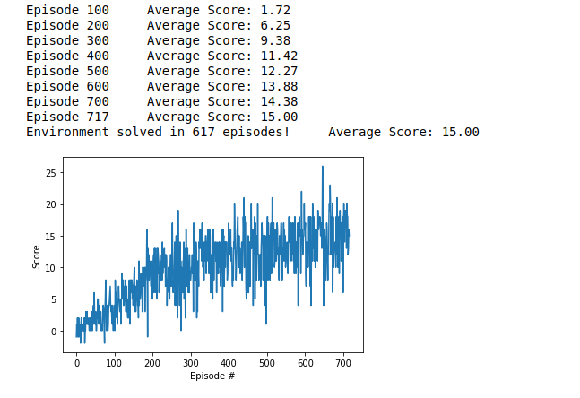

# Navigation Project Report

In this project, we trained an agent using a Deep Q-Network to interact with a 3D environment, in which the agent needed to collect certain objects while avoiding others.

## Environment

The agent's state in the environment is encoded as a 37-dimensional vector, with 36 values representing ray vectors of surrounding objects, and 1 dimension for the agent's velocity.

The agent has 4 actions available, corresponding to moving forward, backware or moving left, right.

Rewards are +1 for a yellow banana, and -1 for a blue banana.

## Learning Algorithm

The learning algorithm was taken from previous lessons in this course and consisted of a deep neural network to approximate the Q function, trained using experience replay.

### Neural network structure

The neural network consisted of:

- Input layer: 37 (state size)
- Hidden layer: 64 neurons, with ReLU activation
- Hidden layer: 64 neurons, with ReLU activation
- Output layer: 4 (action size)

### Training

At each step in an episode, the agent will either select an action from its Q-network, or take a random action, based on exploration factor, epsilon. Epsilon begins at 1 (meaning always choose a random action), and decays to 0.01 at a rate of 0.995 per episode (i.e. epsilon_n = 0.995^n).

The action is then applied to the environment, providing a new state and reward (if any). These new values are added to the replay buffer. The replay buffer is 10k entries, with older entries being discarded as newer ones come in. Sampling is uniform across the buffer.

Every 4 steps, the model is trained from 64 values extracted from the replay buffer. Two copies of the Q-network are then used to train the model. A "local" copy represents the latest known parameters of the model, while a "target" copy has slower moving parameters, which are copied from the local network. This two network approach prevents errors from fluctuating drastically during a training epoch.

We compute the Q values from the target network for the next state, then estimate the Q value for the current state by adding the reward to the next-state Q values, weighted by gamma (set to 0.99). This value is compared to the Q-value currently predicted by the local model, using a mean squared error loss. The error is fed into an Adam optimizer, with a learning rate of 0.0005.

Once the weights have been optimized for this batch of samples, the parameters from the local network are weighted in to the parameters of the target network, using weight tau, set to 0.001.

## Results

The agent achieved 100-episode average score of 15 in 617 episodes. Results of the training are stored in `checkpoint.pth`

## Future work

I attempted to incorporate the prioritized recall for the replay buffer, in particular the rank-based method, however quickly got bogged down in implementation details. It turns out that the implementation strongly affects the running time, as calculating the probabilities for the experiences is the dominating component. OpenAI has implemented a variant of prioritized replay, which might be a faster way to get it working.

I did not attempt dueling or double DQN methods, but they would be obvious next steps.
